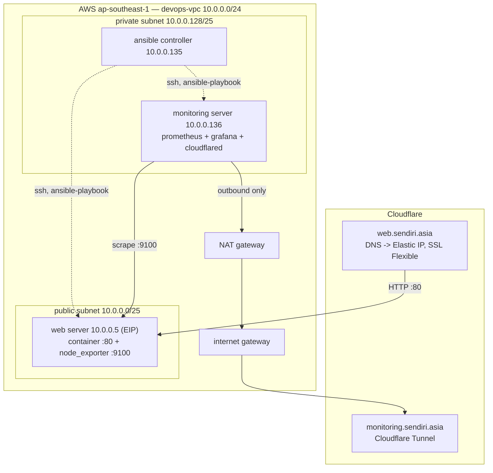

# devops-bootcamp-fyp

Final project DevOps Bootcamp — VPC AWS, tiga server (web / Ansible controller /
monitoring), aplikasi disajikan sebagai container dari ECR, stack pemantauan
Prometheus + Grafana, dan dua subdomain Cloudflare untuk akses awam.

- **URL aplikasi:** https://web.sendiri.asia
- **URL monitoring:** https://monitoring.sendiri.asia
- **URL repo:** https://github.com/mohamadarifin97/devops-bootcamp-fyp

## Struktur projek

```
app/         Dockerfile multi-stage (klon Infratify/ship, bina, sajikan via nginx)
terraform/   VPC, subnet, security group, EC2, ECR, S3 backend
ansible/     Playbook dijalankan DARI controller (bukan local machine)
README.md
```

## Seni bina



Rujukan penuh nama & nilai (VPC/subnet/SG/route table/gateway/server IP, nama
bucket state, nama repo ECR) ada dalam `terraform/` — setiap fail `.tf` diberi
komen ringkas di mana ia relevan.

## Cara jalankan

1. **Prasyarat (buat sekali sahaja, manual):**
   - Bucket state S3: `aws s3api create-bucket --bucket devops-bootcamp-terraform-arifin --region ap-southeast-1 --create-bucket-configuration LocationConstraint=ap-southeast-1`
   - Tunnel Cloudflare untuk `monitoring.sendiri.asia`, token disimpan ke SSM:
     `aws ssm put-parameter --name /devops-bootcamp-fyp/tunnel-token --type SecureString --value "<token>"`
   - DNS record `web.sendiri.asia` -> Elastic IP web server (proxied, SSL/TLS mode Flexible), dikemas kini selepas `terraform apply` pertama.

2. **Peruntukan infra:**
   ```bash
   cd terraform
   terraform init
   terraform apply
   ```
   Ini mencipta VPC, kedua-dua SG, tiga EC2 (SSM instance profile pada
   ketiga-tiga), Elastic IP, repo ECR, dan but controller dengan Ansible +
   kunci SSH + inventory + secrets terjana automatik.

3. **Bina & tolak image aplikasi** — ikut `app/README.md`.

4. **Jalankan konfigurasi DARI controller** (bukan local machine):
   ```bash
   aws ssm start-session --target <instance-id-controller>
   git clone https://github.com/mohamadarifin97/devops-bootcamp-fyp.git
   cd devops-bootcamp-fyp/ansible
   ansible-galaxy install -r requirements.yml
   ansible-playbook -i ~/inventory.ini site.yml -e @/etc/devops-fyp/secrets.yml
   ```

5. Tetapkan ingress rule `monitoring.sendiri.asia -> http://grafana:3000`
   dalam Cloudflare Zero Trust dashboard bagi tunnel yang sama.

Halaman ini diterbitkan secara awam melalui GitHub Pages, dikemas kini automatik
oleh `.github/workflows/pages.yml` setiap kali push ke `main`.
